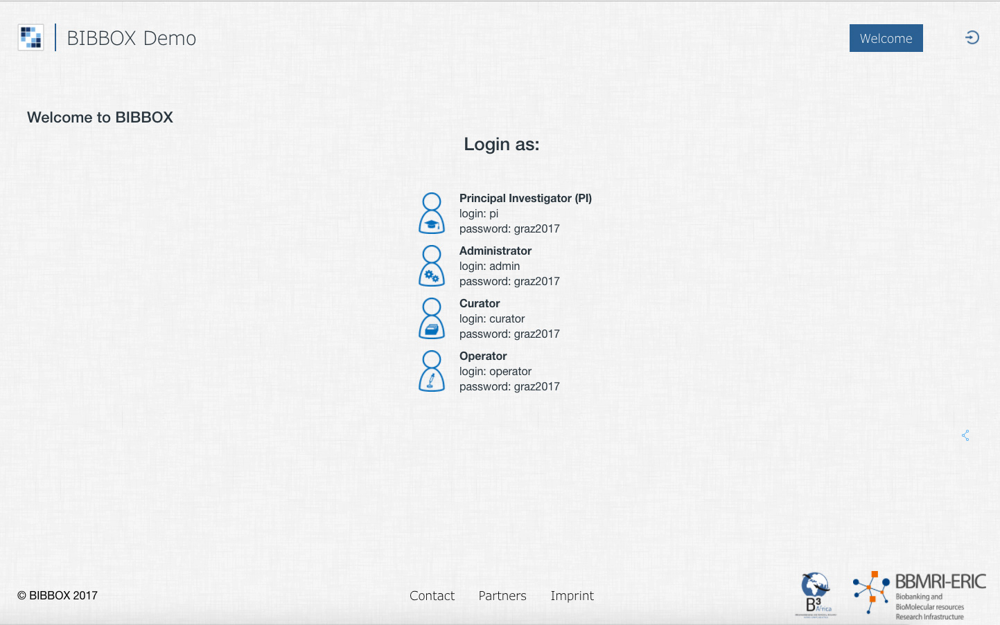

# Requirements

### Hardware

**Minimum**

The following will show you the minimum requirements of the BIBBOX virtual machine. Please note, that installing any applications within BIBBOX will require additional resources!

* CPU cores: 1
* Memory: 4096 MB
* Disk space: 20 GB

**Recommended for Development**

For development purposes we recommend a virtual machine with the following specifications:

* CPU cores: 4
* Memory: 8192 MB
* Disk space: 100 GB

**Production**

For production, please calculate the additional resources you will need, depending on the applications you are going to install within the BIBBOX.


### Software

* Download and install VirtualBox -> <https://www.virtualbox.org>

# Installation instructions

### 1.) Download BIBBOX image

If you want to install the BIBBOX server as a virtual machine download the latest version from  <http://bibbox.bbmri-eric.eu/resources/machine/>

### 2.) Import the image into VirtualBox

If you only have access via command line, you can import the image with the following command:
```vboxmanage import path/to/bibbox-latest.ova```

If you have a user interface on your system (e.g. it's your local PC), follow these steps:

* Open up VirtualBox on your PC or Mac
* CLick on **File > Import Appliance...**
* Select the downloaded image and click **Continue**

### 3.) Start the machine


If you download the image for local testing, this machine comes with a GUI (Graphical User Interface) and is ready 
to be used as is.

You can just log in with username **v** and passwords **vendetta** and start using the BIBBOX by accessing 
it in a Browser like Firefox at the URL <http://bibbox.local.domain>.

Please be aware, that after the virtual machine has started, it takes several minutes until the BIBBOX can be accessed.


If you want to access the server from a client, some further configuration is necessary:

1. First of all, you will need to decide for an URL on which to access the BIBBOX. For this, you or your organisation needs to provide a domain of the likes of **bibbox.org** or **replace.by.your.domain**. 
2. Login into the VM, either in the GUI or with an ssh, as configured in the VM network connection. 
3. Make the following changes. 

    * In `/etc/bibbox/bibbox.cfg` 
    
        change the domain with
        
            sudo sed -i 's/bibbox.local.domain/replace.by.your.domain/g' *
            
            
    * In `/etc/apache2/sites-available`
    
        change the domain names in the proxy files with  
    
            sudo sed -i 's/bibbox.local.domain/replace.by.your.domain/g' *
            
    * And in `/etc/hosts`
    
        change
    
            127.0.0.1       eb3kit
            
        to the first part of your URL (don't write 'replace', this is just the example)
        
            127.0.0.1       replace
            
5. Finally run to make the changes take effect

        `sudo service apache2 stop` 
        `sudo service apache2 start` 
        `sudo service liferay stop` 
        `sudo service liferay start` 
        
    

#### 4.) Network configuration

If your hosting provider offers you an administration panel for managing domains and subdomains, you should use that to point to your BIBBOX. Otherwise, if you use Apache, you can do it yourself using this guide:

1. On your server navigate to your apache configuration directory. On Linux base machines this defaults to **/etc/apache2/sites-available**.
2. Create a file named **005-bibbox.conf**. On Linux based systems you can do this with `nano 005-bibbox.conf`.
4. Copy this proxy configuration into the file, change the ServerName, ServerAlias and the port you configured for your virtual machine. You should also change the name of the log files according to your vm name. Then save with **CTRL + O** and **Enter**.

        <VirtualHost *:80>
            ServerName replace.by.your.domain
            ServerAlias *.replace.by.your.domain

            <Proxy *>
                Order deny,allow
                Allow from all
            </Proxy>

            ErrorLog ${APACHE_LOG_DIR}/bibbox.error.log

            # Possible values include: debug, info, notice, warn, error, crit,
            # alert, emerg.
            LogLevel debug

            CustomLog ${APACHE_LOG_DIR}/bibbox.access.log combined

            ProxyRequests           Off
            ProxyPreserveHost On
            ProxyPass               /api/kernels/       ws://127.0.0.1:80/api/kernels/
            ProxyPassReverse        /api/kernels/       ws://127.0.0.1:80/api/kernels/
            ProxyPass               /       	        http://127.0.0.1:80/
            ProxyPassReverse        /       	        http://127.0.0.1:80/
        </VirtualHost>

5. Now navigate to the **/etc/apache2/sites-enabled** directory and create a symbolic link to your new proxy file with `ln -s ../sites-available/005-bibbox.conf`. 
6. Next reload Apache to make it recognize your changes by running `service apache2 reload`.
7. You can now access the BIBBOX from anywhere in the web by calling your URL (e.g. **replace.by.your.domain**) in the browser's address bar!


