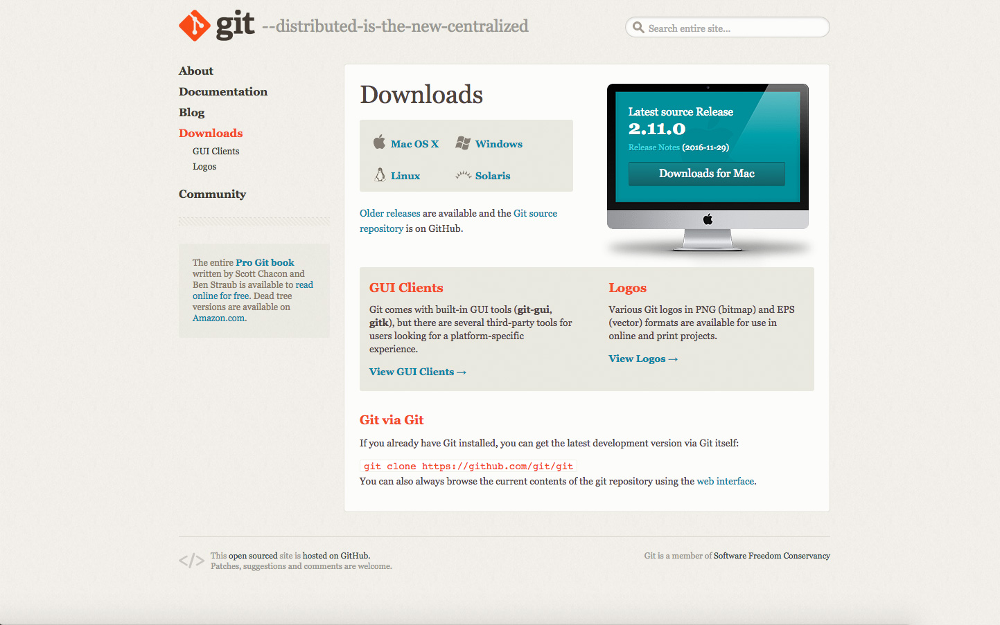
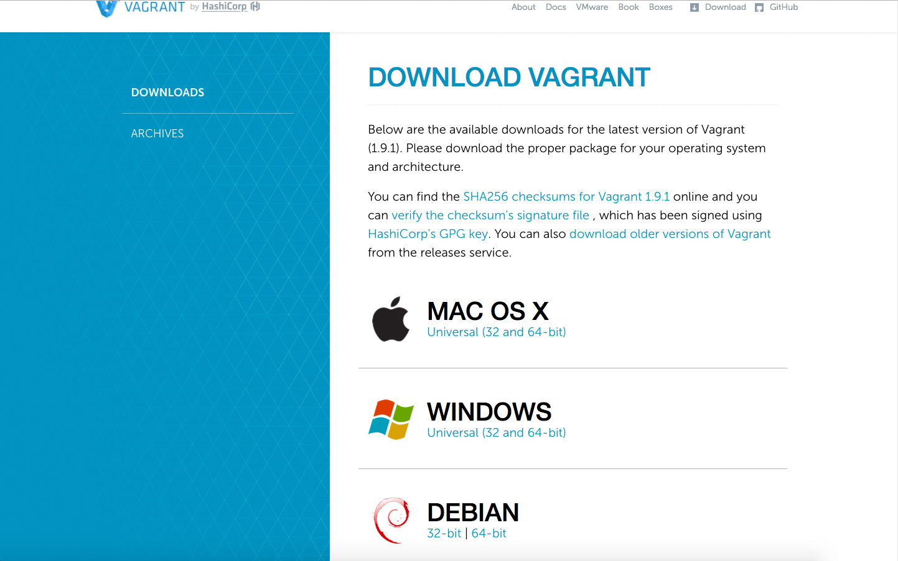
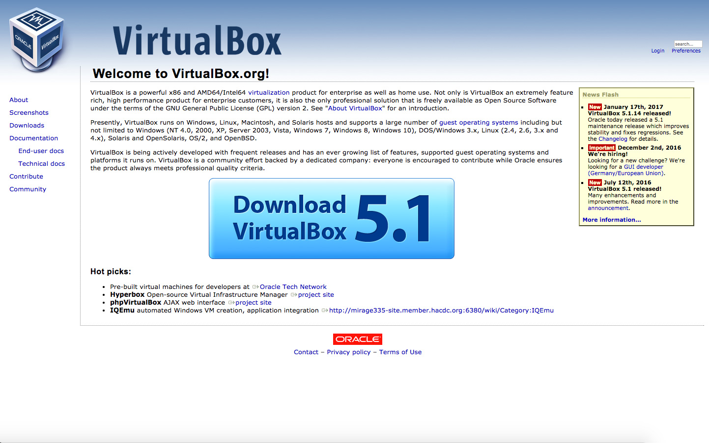
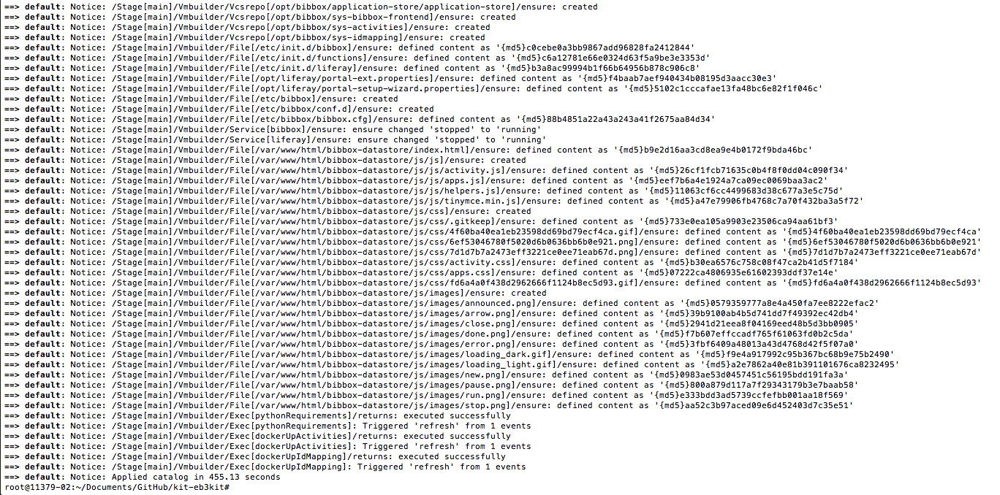

# Requirements

Requirements

* Download and install Git -> <https://git-scm.com/>
* Download and install Vagrant -> <https://www.vagrantup.com>
* Download and install VirtualBox -> <https://www.virtualbox.org>


The automatic BIBBOX setup depends on multiple repositories and one ZIP file download link:

* Liferay ZIP file: <http://downloads.bibbox.org/liferay-ce-portal-tomcat-7.0-ga3.zip>
* BIBBOX Repository 'sys-bibbox-vmscripts': <https://github.com/bibbox/sys-bibbox-vmscripts>
* BIBBOX Repository 'sys-bibbox-frontend': <https://github.com/bibbox/sys-bibbox-frontend>
* BIBBOX Repository 'sys-bibbox-backend': <https://github.com/bibbox/sys-bibbox-backend>
* BIBBOX Repository 'sys-activities': <https://github.com/bibbox/sys-activities>
* BIBBOX Repository 'sys-idmapping': <https://github.com/bibbox/sys-idmapping>


# Configuration

***Make sure to configure your settings before running the installation process!***


### Virtual machine configuration

The following parameters are available to configure your virtual machine. You can change them in `Vagrantfile`:

| Parameter        | Description                                                                                      | Default           |
|------------------|--------------------------------------------------------------------------------------------------|-------------------|
| vmname           | Name of your virtual machine.                                  	                              | eB3Kit            |
| bibboxbaseurl    | Base url of your BIBBOX installation. Needs to match 'bibboxbaseurl' parameter in 'environments\production\manisfests\config.pp'. <sup>1</sup>                                                                       | eb3kit.bibbox.org |
| cpus             | Number of CPU cores assigned to the virtual machine.                                             | admin@bibbox.org  |
| memory           | Total amount of memory in MB (RAM) available to the virtual machine.                             | 8192              |
| disksize         | Amount of additional disk space in MB (hard drive).                                              | 301 * 1024 	      |
| diskname         | The disk file will be named "disk-**diskname**.vdi".                                             | 301GB             |
| ip               | The static IP to your BIBBOX within the host's network.                                          | 192.168.10.10     |
| http_port        | The port to your BIBBOX within the host's network.                                               | 1080              |
| ssh_vagrant_port | Port for SSH access used internally by Vagrant.                                                  | 2230              |
| ssh_port         | Port used for SSH access from outside the host machine.                                          | 2231              |

[1]: If you have a domain pleace follow step 5a). If you are testing it localy without a domain please follow step 5b).

### BIBBOX configuration

The following parameters are available to configure your BIBBOX. You can change them in `environments\production\manisfests\config.pp`:

| Parameter     | Description                                                                                      | Default           |
|---------------|--------------------------------------------------------------------------------------------------|-------------------|
| bibboxkit     | Name of the BIBBOX kit, currently only eB3kit is available.                                  	   | eB3Kit            |
| bibboxbaseurl | Base url of your BIBBOX installation. Needs to match 'bibboxbaseurl' parameter in 'Vagrantfile'. | eb3kit.bibbox.org |
| serveradmin   | Mail address of the administrator.                                                               | admin@bibbox.org  |
| db_user       | User of the Liferay database.                                                                    | liferay           |
| db_password   | Password of the Liferay database.                                                                | bibbox4ever	   |
| db_name       | Name of the Liferay database.                                                                    | lportal           |


# Quick installation guide

If you're already familiar with the BIBBOX installation process and only need a little reminder, this guide is for you.

1. Clone the Git repository, `git clone https://github.com/bibbox/kit-eb3kit.git your-vm-name`
2. In terminal, navigate to the repository, `cd your-vm-name`
3. Edit the VM and BIBBOX configuration as described above, `nano Vagrantfile` and `nano environments\production\manisfests\config.pp`
4. Edit the puppet configuration as descibed above, **nano  environments/production/manifests/config.pp**
5. Run the setup by executing the command `vagrant up` from your base directory.
6. Wait while your BIBBOX is being installed (can take quite long, depending on internet connection)
7. Configure your host's proxy or DNS to redirect to the BIBBOX VM at **http://bibboxbaseurl** or use **<http://192.168.10.10:1080>** (replace IP and port with your custom configuration).
8. You can log in to your BIBBOX with the users ***bibboxadmin***, ***admin***, ***pi***, ***curator*** and ***operator***. For all users the default password is ***graz2017***.
9. To configure the liferay portal of your BIBBOX, log in as user ***bibboxadmin***.


# Detailed installation guide

### 1.) Setting up the requirements

In order to run automatic BIBBOX-setup, you need to have Git, Vagrant and VirtualBox installed on your host machine.

####If your host machine is a local PC or Mac, you can download those tools from their official websites:

<https://git-scm.com/downloads>




<https://www.vagrantup.com/downloads.html>




<https://www.virtualbox.org/>




####If your host is a Linux machine or an Linux based remote server, you can instead install these tools with **apt-get**:

`$ sudo apt-get update`

`$ sudo apt-get install git`

`$ sudo apt-get install vagrant`

`$ sudo apt-get install virtualbox`


## 2.) Cloning the installer scripts

Next, you need to choose an directory to clone the installation scripts to.

On Linux based systems you can create a new directory with this command:

`mkdir /path/to/directory-name`

Now navigate to the directory using this command:

`cd /path/to/directory-name`

From there you can clone the repository <https://github.com/bibbox/kit-eb3kit.git> either with the GitHub client for Windows and Mac <https://desktop.github.com/> or simply with the following command:

`git clone https://github.com/bibbox/kit-eb3kit.git your-kit-name`

Once the repository has finished cloning, navigate into it by using the following command:

`cd your-kit-name`


## 3.) VM and BIBBOX configuration

***Make sure to configure your settings before running the installation process!***

If you are just trying to set up a demo, you should at least check out and edit **required** parameters, but be sure to change everything to your needs before setting up a production machine.


#### Virtual machine configuration

The following parameters are available to configure your virtual machine. You can change them in `Vagrantfile`.
On Linux based systems you can edit this file with `nano Vagrantfile` and save it with **Control + O** and then **Enter** after you are done.

**Required parameters:**

* bibboxbaseurl
* ip
* http_port
* ssh_vagrant_port
* ssh_port

| Parameter        | Description                                                                                      | Default           |
|------------------|--------------------------------------------------------------------------------------------------|-------------------|
| vmname           | Name of your virtual machine.                                  	                              | eB3Kit            |
| bibboxbaseurl    | Base url of your BIBBOX installation. Needs to match 'bibboxbaseurl' parameter in 'environments\production\manisfests\config.pp'.                                                                       | eb3kit.bibbox.org |
| cpus             | Number of CPU cores assigned to the virtual machine.                                             | admin@bibbox.org  |
| memory           | Total amount of memory in MB (RAM) available to the virtual machine.                             | 8192              |
| disksize         | Amount of additional disk space in MB (hard drive).                                              | 301 * 1024 	      |
| diskname         | The disk file will be named "disk-**diskname**.vdi".                                             | 301GB             |
| ip               | The static IP to your BIBBOX within the host's network.                                          | 192.168.10.10     |
| http_port        | The port to your BIBBOX within the host's network.                                               | 1080              |
| ssh_vagrant_port | Port for SSH access used internally by Vagrant.                                                  | 2230              |
| ssh_port         | Port used for SSH access from outside the host machine.                                          | 2231              |

This is how it looks like in the file:

```
# Name of the virtual machine
# default: "eb3kit"
vmname = "eb3kit"

# Base url the bibbox kit (should match puppet config file)
# default: "eb3kit.bibbox.org"
bibboxbaseurl = "eb3kit.bibbox.org"

# Number of assigned CPU cores
# default: 4
cpus = 4

# Total amount of memory in MB (RAM)
# default: "8192" (8GB)
memory = "8192"

# Amount of additional disk space in MB (hard drive)
# default: 301 * 1024 (301GB)
disksize = 301 * 1024

# Name of the disk
# default "301GB"
diskname = "301GB"

# Static IP and port within the host's network
# ip default: "192.168.10.10"
# http_port default: 1080
ip = "192.168.10.10"
http_port = 1080

# Ports used for SSH connection
# ssh_vagrant_port is only for Vagranbt internally
# default: 2230
# ssh_port is used to connect from outside
# default: 2231
ssh_vagrant_port = 2230
ssh_port = 2231
```

#### BIBBOX configuration

The following parameters are available to configure your BIBBOX. You can change them in `environments\production\manisfests\config.pp`.
On Linux based systems you can edit this file with `nano environments\production\manisfests\config.pp` and save it with **Control + O** and then **Enter** after you are done.

**Required parameters:**

* bibboxbaseurl
* serveradmin

| Parameter     | Description                                                                                      | Default           |
|---------------|--------------------------------------------------------------------------------------------------|-------------------|
| bibboxkit     | Name of the BIBBOX kit, currently only eB3kit is available.                                  	   | eB3Kit            |
| bibboxbaseurl | Base url of your BIBBOX installation. Needs to match 'bibboxbaseurl' parameter in 'Vagrantfile'. | eb3kit.bibbox.org |
| serveradmin   | Mail address of the administrator.                                                               | admin@bibbox.org  |
| db_user       | User of the Liferay database.                                                                    | liferay           |
| db_password   | Password of the Liferay database.                                                                | bibbox4ever	   |
| db_name       | Name of the Liferay database.                                                                    | lportal           |

This is how it looks like in the file:

```
# General Kit Information
# Currently only "eB3Kit" is available for bibboxkit
bibboxkit		=> "eB3Kit",
bibboxbaseurl	=> "eb3kit.bibbox.org",
serveradmin		=> "admin@bibbox.org",

# Database Information
db_user			=> "liferay",
db_password		=> "bibbox4ever",
db_name			=> "lportal"
```


## 4.) Running the installer

You can now run the automated installation process with the following command:

`vagrant up`

BIBBOX will now automatically download all dependencies, set up an ***UBUNTU Trusty*** virtual machine, copy and symlink its contents and boot up the system.
Please note, that this can take quite a while depending on internet connection speed and processing power of the host machine.

Just leave your CLI open and do some other work while the installation is running.
You will recognize it has finished, when you see a message saying "Applied catalog in xyz seconds" and you can write commands again in the terminal.




## 5a.) Proxy, DNS configuration (with domain name)

After the installation has finished, BIBBOX will automatically start its internal configuration process and boot up the BIBBOX's Liferay portal.
Please note, that this process will take several minutes!

If you need more information on the Liferay boot process, you can view the log by logging into the virtual machine with `vagrant ssh` and tailing the log file with `sudo tail -f -n 200 /opt/liferay/tomcat-8.0.32/logs/catalina.out`.

After everything is finished, you can access your freshly installed BIBBOX in your browser at http://**192.168.10.10:18080** (replace the numbers with the IP port you configured before) on the host machine.

***In case you installed the BIBBOX on a remote server, you will need to do some additional configuration before you can access your BIBBOX from the web! See below:***


If you have access to your hosting providers administration panel you can also rent a domain name like "bibbox.org" and point it to that address.


To access your BIBBOX from the everywhere on the web, you need to map your host's IP address to the IP and port of your BIBBOX. We strongly recommend renting a domain like **bibbox.org** for easier access. If your hosting provider offers you an administration panel for managing domains and subdomains, you should use that to point to your BIBBOX. Otherwise you can do it yourself using this guide:

1. On your host machine navigate to your apache configuration directory. On Linux base machines this defaults to **/etc/apache2/sites-enabled**.
2. Create a file named **001-bibbox.conf**. On Linux based systems you can do this with `nano 001-bibbox.conf`.
3. Create a file named **001-bibbox.conf**. On Linux based systems you can do this with `nano 001-bibbox.conf`.
4. Copy this proxy configuration into the file, change the ServerName, ServerALias and the IP:Port combinations with your domain, the IP of the host machine and the port you configured for your virtual machine. Then save with **Control + O** and **Enter**.

        <VirtualHost *:80>
            ServerName eb3kit.bibbox.org        # Replace this with your domain
            ServerAlias *.eb3kit.bibbox.org     # Replace this with your domain

            <Proxy *>
                Order deny,allow
                Allow from all
            </Proxy>

            ErrorLog ${APACHE_LOG_DIR}/eb3kit.error.log

            # Possible values include: debug, info, notice, warn, error, crit,
            # alert, emerg.
            LogLevel debug

            CustomLog ${APACHE_LOG_DIR}/eb3kit.access.log combined

            ProxyRequests           Off
            ProxyPreserveHost On
            ProxyPass               /api/kernels/       ws://212.232.25.224:1090/api/kernels/   # Replace the IP and port
            ProxyPassReverse        /api/kernels/       ws://212.232.25.224:1090/api/kernels/   # Replace the IP and port
            ProxyPass               /       	        http://212.232.25.224:1090/             # Replace the IP and port
            ProxyPassReverse        /       	        http://212.232.25.224:1090/             # Replace the IP and port
        </VirtualHost>

5. Now reload the Apache to make it recognize your changes by running `service apache2 reload`.
6. You can now access the BIBBOX from anywhere in the web by calling your domain or IP:Port combination in the browser's address bar!


## 5b.) local DNS configuration (local test without domain name)

If you would like to test the BIBBOX System localy without a domain you can use a DNS proxy (aka "Fake DNS") tool to simulate a domain address. 

* Download the dnschef tool https://thesprawl.org/media/projects/dnschef-0.3.zip (Depending on your browser you have to confirm the certificate or add the certificate to an exception list)
* Unzip the folder
* Create a file called bibbox.ini, replace the **bibbox.local.domain** with the baseurl you selected and the ip address **192.168.10.10** with the ip your VM is accessable.

                [A] # Queries for IPv4 address records
                *.bibbox.local.domain=**192.168.10.10**

* Run: **sudo ./dnschef.py --file bibbox.ini -q** in the folder
  * If you get an error like:
  
                Traceback (most recent call last):
                File "./dnschef.py", line 39, in <module>
                from dnslib import *
                ImportError: No module named dnslib
                
  * You need to add the requerd moduls to your system: sudo pip install dnslib
* Change your DNS Server to access the local configured dnschef (127.0.0.1)
  * MAC:
  * Click on your "Apple" menu and choose "System Preferences".
  * Double-Click on the “Network” icon.
  * Select your Network Connection
  * Select "Advanced"
  * In the "DNS" Tab add 127.0.0.1
  * "OK"
  * "Apply"
* You can now access the BIBBOX with the baseurl you selected, when dnschef is stated, in the browser's address bar!
* **!!Remember to change the DNS Server enty back when you stop dnschef.**


## 6.) Login and administration

You can now log into your BIBBOX with one of the five default users and the password **graz2017**:

* bibboxadmin
* admin
* pi
* curator
* operator

If you want to make changes to the default configuration of the portal (e.g. change the title or logo), you need to log in as **bibboxadmin**.


## 7.) Access via SSH

In case you need to access the inside of the virtual machine over SSH, there are two ways to do so. If you are already on the host system, you can just run the command `vagrant ssh` from where cloned the GIT repository. You will then be logged in as user **vagrant** with password **vagrant** and home directory **/home/vagrant**. This user is a superuser, so you should not have any permission problems.

When your machine is hosted on a remote server, or you go in production, you will probably want to access the virtual machine from outside the host system as well. For this scenario, we have another user called **vmadmin** with default password **bibbox4ever** and home directoy **/home/vmadmin**. To connect via SSH open up a terminal on any computer with an active internet connection and enter `ssh vmadmin@xxx.xxx.xx.xxx -p 2231` replacing the **x** with the public IP of your host system and the port **2231** with the SSH port you configured during installation. When prompted for a password, just enter the password you set for the **vmadmin** user (default **bibbox4ever**).


## 8.) Enjoy

That's all, enjoy your BIBBOX!

# Domain Migration

if you want to migrate from SOME.OLD.DOMAIN to YOUR.NEW.DOMAIN, login into your VM and make the following steps 

* stop the apache service

`sudo service apache2 stop`


* replace all SOME.OLD.DOMAIN  in the proxy files

`cd /etc/apache2'

`sudo cp -r sites-available sites-available-back`

`cd sites-available`

`sed -i 's/SOME.OLD.DOMAIN/YOUR.NEW.DOMAIN/g' *`

`sudo service apache2 start`

* change to config for the portal

`cd /etc/bibbox`

`sudo service liferay stop`

`sudo sed -i 's/SOME.OLD.DOMAIN/YOUR.NEW.DOMAIN/g' bibbox.cfg`

`sudo service liferay start`

The following hints help you to migrate BIBBOX Apps:

**owncloud**

add the YOUR.NEW.DOMAIN as trusted domain in your owncloud container

`sudo docker exec -it YOUR-OWNCLOUD-CONTAINER-NAME /bin/bash`

`sed -i 's/SOME.OLD.DOMAIN/YOUR.NEW.DOMAIN/g' config/config.php`


